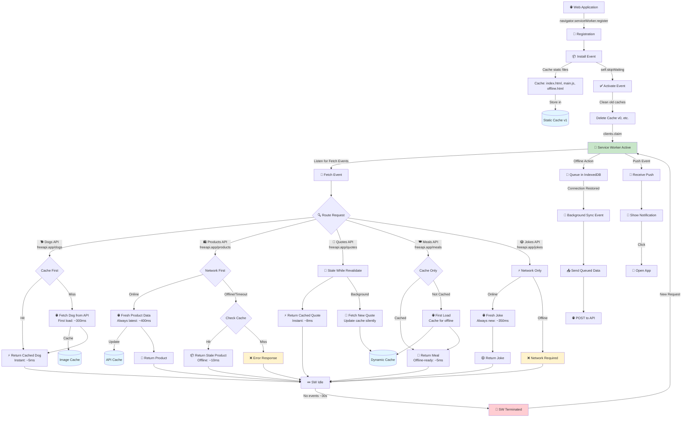

# Service Worker Caching Strategies - Complete Flow Diagram



## Real-World Performance Metrics

Based on actual FreeAPI.app response times:

| Strategy | First Load | Cached Load | Offline Behavior |
|----------|-----------|-------------|------------------|
| **Cache First (Dogs)** | ~300ms (network) | ~5ms (cache) | ✅ Works offline |
| **Network First (Products)** | ~400ms (network) | ~400ms (network) or ~10ms (offline) | ⚠️ Stale data offline |
| **Stale While Revalidate (Quotes)** | ~350ms | ~8ms + background update | ✅ Shows stale data |
| **Cache Only (Meals)** | ~320ms (first) | ~5ms (cache) | ✅ Fully offline |
| **Network Only (Jokes)** | ~350ms | Always ~350ms | ❌ Fails offline |

## API Integration Details

### 1. Cache First - Dogs API
```javascript
fetch('https://api.freeapi.app/api/v1/public/dogs/dog/random')
// Returns: { name, breed_group, origin, temperament, ... }
// Strategy: Instant from cache, update in background
// Use case: Static-like data that rarely changes
```

### 2. Network First - Products API
```javascript
fetch('https://api.freeapi.app/api/v1/public/randomproducts?page=1&limit=1')
// Returns: { title, price, discountPercentage, rating, ... }
// Strategy: Always try network first, fallback to cache
// Use case: Dynamic data that should be fresh
```

### 3. Stale While Revalidate - Quotes API
```javascript
fetch('https://api.freeapi.app/api/v1/public/quotes/quote/random')
// Returns: { content, author, tags, ... }
// Strategy: Return cache instantly, update in background
// Use case: Content that updates frequently
```

### 4. Cache Only - Meals API
```javascript
fetch('https://api.freeapi.app/api/v1/public/meals/meal/random')
// Returns: { strMeal, strCategory, strArea, ... }
// Strategy: Only serve from cache after first load
// Use case: Offline-first applications
```

### 5. Network Only - Jokes API
```javascript
fetch('https://api.freeapi.app/api/v1/public/randomjokes?limit=1')
// Returns: { content, categories, ... }
// Strategy: Always fetch fresh, never cache
// Use case: Content that must always be current
```

## Testing Real Scenarios

### Test Offline Functionality:
1. Load each API once (builds cache)
2. Open DevTools → Network → Set "Offline"
3. Try each button:
   - **Dogs (Cache First)** ✅ Works perfectly
   - **Products (Network First)** ✅ Returns stale data
   - **Quotes (SWR)** ✅ Returns stale data
   - **Meals (Cache Only)** ✅ Works perfectly
   - **Jokes (Network Only)** ❌ Fails (expected)

### Monitor Cache Growth:
1. DevTools → Application → Cache Storage
2. Load different APIs multiple times
3. Watch cache automatically trim old entries
4. See version management in action

### Test Background Sync:
1. Go offline
2. Click "Send Message"
3. Check IndexedDB for queued items
4. Go online → automatic sync!
